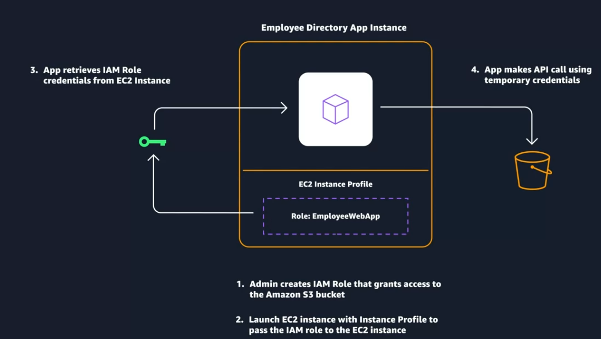

# AWS Identity and Access Management (IAM)

## What is IAM?

**AWS Identity and Access Management (IAM)** is a web service that helps you securely control access to your AWS account and resources.

IAM provides:

- **Authentication** – Determines who or what is trying to access AWS.
- **Authorization** – Determines what actions that identity is allowed to perform.
- **Granular permissions** – Allows users and services to access only the resources they need.

IAM allows you to share access to AWS resources without sharing your AWS account password or access keys.

## IAM Features

- **Global service** – IAM is not specific to a Region.
- **Integrated with AWS services** – IAM works with many AWS services by default.
- **Password policies** – Define password complexity and rotation requirements.
- **MFA support** – IAM supports Multi-Factor Authentication.
- **Identity federation** – Users can use existing identities from a corporate network or identity provider to obtain temporary AWS access.
- **No additional charge** – IAM is available at no additional cost.

# IAM User

An **IAM user** represents a person or service that interacts with AWS. The user is created within an AWS account and can be given permissions to access AWS resources.

Each person should generally have their **own IAM user and credentials** instead of sharing credentials.

## IAM User Credentials

An IAM user can have:

### Console Access

Uses a **username and password** to sign in to the AWS Management Console.

### Programmatic Access

Used with:

- AWS CLI
- AWS APIs
- AWS SDKs

AWS provides **access keys** for programmatic access.

> IAM user credentials are considered long-term credentials because they remain associated with the user until they are rotated or removed.

Permissions can be assigned directly to users, but managing permissions this way becomes difficult as the number of users grows.

# IAM Group

An **IAM group** is a collection of IAM users.

Permissions assigned to a group are **inherited by all users in that group**.

Using groups makes permission management easier and more scalable.

### Example

```text
AWS Account
│
├── Developers Group
│   ├── User A
│   └── User B
│
├── Security Group
│   └── User C
│
└── Admins Group
    └── User D
```

If a new developer joins, create the user and add them to the **Developers** group. They receive the permissions assigned to that group.

If a developer changes to a security role, remove them from Developers and add them to the **Security** group.

## IAM Group Rules

- A group can contain **many users**.
- A user can belong to **multiple groups**.
- A group **cannot contain another group**.

# Root User vs IAM User

The **root user** is the identity created when an AWS account is first created.

- The root user has full access to all AWS resources by default.
- New IAM users, groups, and roles have **no permissions by default**.
- Permissions must be explicitly granted to IAM identities.

Permissions in IAM are granted using **IAM policies**.

# IAM Policy

An **IAM policy** is a document that defines permissions for AWS resources and actions.

Policies can be attached to:

- IAM users
- IAM groups
- IAM roles

When an IAM identity makes a request, AWS evaluates the policies associated with it to determine whether the request is **allowed or denied**.

Most IAM policies are written as **JSON documents**.

## IAM Policy Elements
When creating a policy, it is required to have each of the following elements inside a policy statement

| Element | Definition | Example |
|---|---|---|
| **Version** | Defines the version of the IAM policy language. | `"Version": "2012-10-17"` |
| **Effect** | Specifies whether access is allowed or denied. | `"Effect": "Allow"` |
| **Action** | Specifies the AWS actions that are allowed or denied. | `"Action": "iam:CreateUser"` |
| **Resource** | Specifies the AWS resource(s) the statement applies to. | `"Resource": "arn:aws:iam::123456789012:user/Bob"` |

### Version

The **Version** element defines the version of the policy language used by AWS to process the policy.

```json
"Version": "2012-10-17"
```

### Effect

The **Effect** element specifies whether access is allowed or denied.

Possible values:

```json
"Effect": "Allow"
```

```json
"Effect": "Deny"
```

### Action

The **Action** element specifies the AWS actions that can be allowed or denied.

Example:

```json
"Action": "iam:CreateUser"
```

The wildcard `*` represents all actions.

### Resource

The **Resource** element specifies the AWS resource(s) to which the policy applies.

The wildcard `*` represents all resources.

# Administrator Policy Example

```json
{
  "Version": "2012-10-17",
  "Statement": [
    {
      "Effect": "Allow",
      "Action": "*",
      "Resource": "*"
    }
  ]
}
```

This policy allows:

- All actions (`Action: *`)
- On all resources (`Resource: *`)

Therefore, it provides **administrator-level access**.

# Granular IAM Policy Example

```json
{
  "Version": "2012-10-17",
  "Statement": [
    {
      "Effect": "Allow",
      "Action": [
        "iam:ChangePassword",
        "iam:GetUser"
      ],
      "Resource": "arn:aws:iam::123456789012:user/${aws:username}"
    }
  ]
}
```

This policy allows an IAM user to:

- Change their own password.
- Get information about their own IAM user.

The `${aws:username}` variable restricts the resource to the **current user's own IAM identity**.

# IAM Best Practices

## 1. Lock Down the AWS Root User

The **root user** has full access to all resources in an AWS account. If its credentials are compromised, the entire account can be at risk.

Best practices:
- Do not share root user credentials.
- Consider deleting root user access keys.
- Enable **MFA** for the root user.
- Use the root user only when required.

## 2. Follow the Principle of Least Privilege

**Least privilege** means granting only the permissions necessary to perform a specific task and nothing more.

Start with the minimum required permissions and add more only when necessary.

## 3. Use IAM Appropriately

IAM is used to manage access to **AWS accounts and AWS resources** through users, groups, roles, and policies.

IAM is **not** intended for:
- Website sign-in/sign-up authentication
- Protecting operating systems
- Protecting networks

## 4. Use IAM Roles When Possible

An **IAM role** provides **temporary credentials** instead of long-term credentials.

Roles are easier to manage and are preferred when applications or AWS services need access to other AWS resources.

| IAM User | IAM Role |
|---|---|
| Uses long-term credentials | Uses temporary credentials |
| Username/password or access keys | Temporary security credentials |
| Credentials remain until rotated/removed | Credentials automatically expire |
| More difficult to manage at scale | Easier to manage |

### Example: EC2 Using an IAM Role

An application running on an EC2 instance can use an IAM role to access an S3 bucket without storing access keys inside the application.



Flow:

1. An administrator creates an IAM role with permission to access the S3 bucket.
2. The EC2 instance is launched with an **instance profile** containing the IAM role.
3. The application retrieves temporary role credentials from the EC2 instance.
4. The application uses those temporary credentials to make API calls to S3.

> **Key idea:** Use IAM roles instead of storing long-term access keys in applications whenever possible.

## 5. Consider Using an Identity Provider (IdP)

An **Identity Provider (IdP)** manages user identities and authentication for an organization.

For organizations with many employees, an IdP can provide a **single source of truth** for identities.

Instead of creating separate IAM users in every AWS account, users can be managed in the organization's IdP and use IAM roles for AWS access.

### Example

If an employee has access to multiple AWS accounts, their identity can be managed in the company's IdP instead of creating a separate IAM user in every account.

If the employee changes roles or leaves the company, their access can be updated or removed centrally.

## 6. Consider AWS IAM Identity Center

**AWS IAM Identity Center** allows users to sign in with a single set of credentials and access their assigned AWS accounts and applications through a central user portal.

It provides:
- Centralized user and group management
- Single sign-on to multiple AWS accounts
- Permission management across accounts
- Integration with third-party identity providers

### IAM vs IAM Identity Center

| IAM | IAM Identity Center |
|---|---|
| Primarily manages identities and access within an AWS account | Designed for centralized access across multiple AWS accounts |
| Users, groups, and roles | Centralized users, groups, and access |
| Suitable for AWS resource access | Suitable for organizations with many users/accounts |


https://606603864014.signin.aws.amazon.com/console