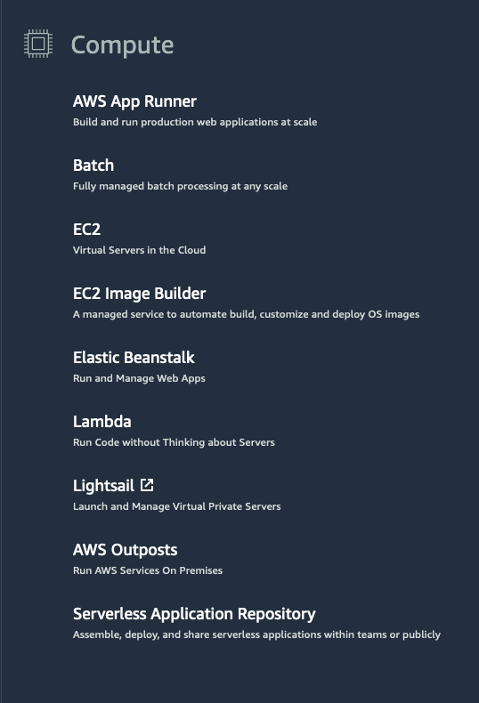

# AWS Compute

## Understanding Servers

A **server** is a computer or collection of computers connected to a network that handles requests from clients and sends responses.

Servers provide resources such as:

- **CPU** – Processes application instructions.
- **Memory** – Stores data needed during processing.
- **Networking** – Enables communication between clients and applications.

Servers commonly handle **HTTP requests** and responses using the **client-server model**.

### Client-Server Model

```text
Client
  │
  │ Request
  ▼
Server
  │
  │ Response
  ▼
Client
```

A client can be a person or a computer that sends a request, while the server processes the request and returns a response.

### Common HTTP Servers

- **Windows:** Internet Information Services (IIS)
- **Linux:** Apache HTTP Server, Nginx, Apache Tomcat

## AWS Compute Options

AWS provides multiple compute services for running applications.

At a fundamental level, compute options can be divided into:

1. **Virtual Machines**
2. **Container Services**
3. **Serverless**



## Virtual Machines

A **virtual machine (VM)** is a software-based representation of a physical server.

It allows you to:

- Allocate CPU, memory, and networking resources.
- Install an operating system.
- Install and run application software.

A **hypervisor** runs on a physical host machine and manages the resources used by virtual machines.

## Amazon EC2

**Amazon Elastic Compute Cloud (Amazon EC2)** provides virtual servers in the AWS Cloud.

```text
AWS Physical Host
      │
   Hypervisor
      │
      ├── Virtual Machine (EC2)
      │      └── Guest Operating System
      │
      └── Virtual Machine (EC2)
             └── Guest Operating System
```

AWS manages:

- Physical host machines
- Hypervisor layer
- Underlying infrastructure

The EC2 instance runs a **guest operating system**, which is used to run your applications.

> **Key idea:** Amazon EC2 provides virtual machines that give you compute capacity in the AWS Cloud.

Understanding EC2 is important because many other AWS compute services use EC2 or similar virtualization concepts behind the scenes.